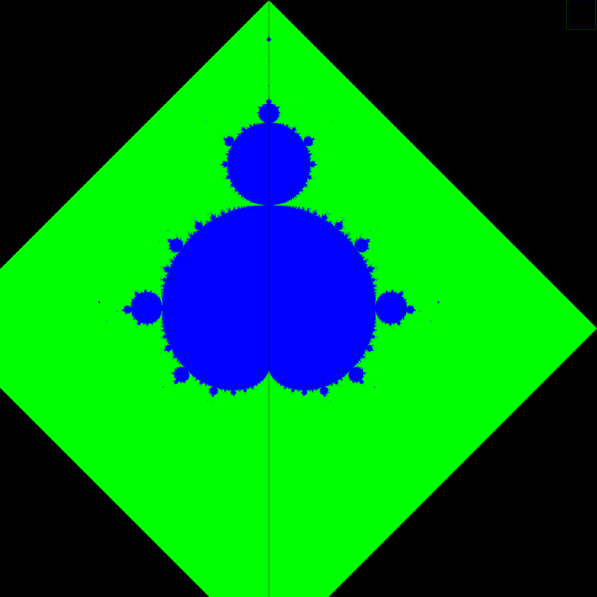

# FunMath

* using familiar tools to write visualization for mathmatical objects. Purely for fun.

## Hilbert Curve

* Hilbert Curve (Hilbert space-filling curve)

## Hausdorff Dimension

* Calculating fractional dimension for 2D images, using box counting method. 
  for example, the following sierpinski triangle has fractional dimension of approximatly 1.58

## Mandelbrot Set

* classical fratals

## Brachistochron

* Visualizing Johann Bernoulli's solution of Brachistochron using Fermat's Principle

! [bernoulli's brachistochron](images/brachistochron.png)

Edit By [MaHua](http://mahua.jser.me)
