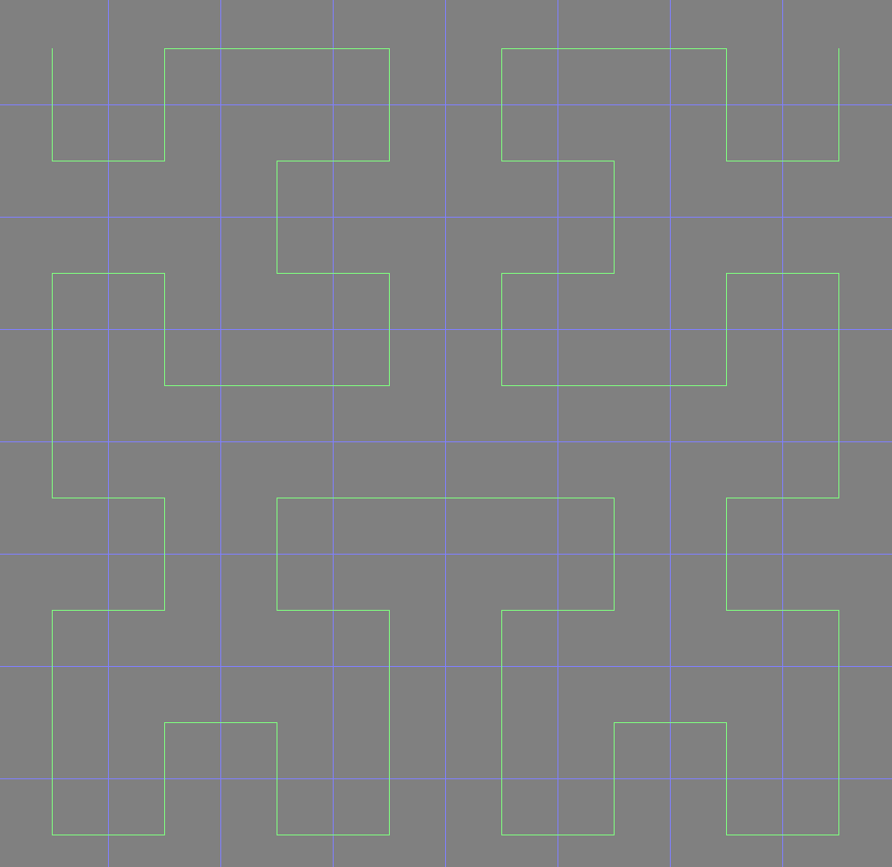

# FunMath

* using familiar tools to write visualization for mathmatical objects. Purely for fun.

## Hilbert Curve

* Hilbert Curve (Hilbert space-filling curve)

Edit By [MaHua](http://mahua.jser.me)

## Hausdorff Dimension

* Calculating fractional dimension for 2D images
